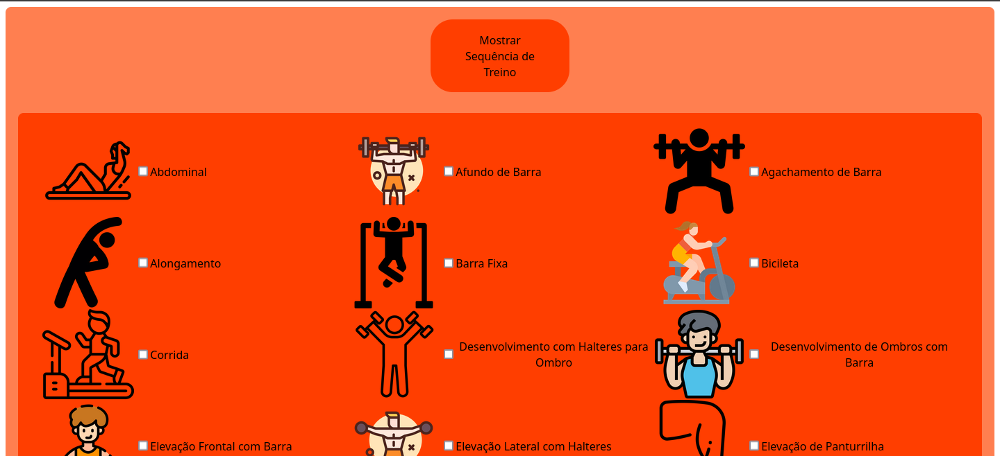
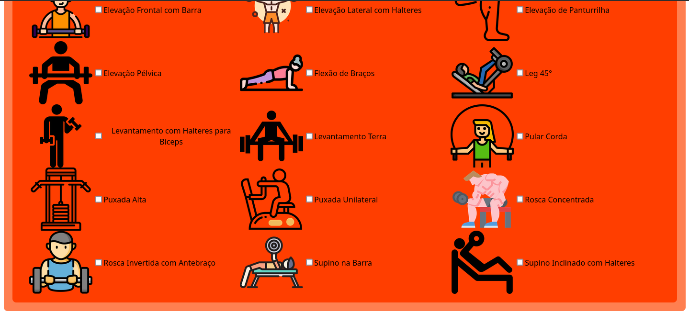
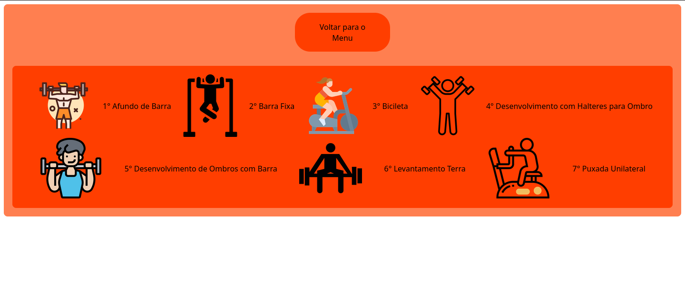

# Guia de Academia

**Conteúdo da Disciplina**: Grafos1 

## Alunos
|Matrícula | Aluno |
| -- | -- |
| 180149598  |  Victor Hugo SIqueira Costa  |
| 180029240  |  Wesley Pedrosa dos Santos  |

## Sobre 
Visando ajudar a obter um melhor rendimento durante os treinos na academia, o *Guia de Academia* lhe indicará a melhor sequência de exercícios, baseado nos exercícios que você possuí interesse, seguindo o caminho mais eficiente através de recomendações práticas.

## Screenshots

## Instalação 
**Linguagem**: JavaScript, HTML, CSS 
**Framework**: Svelte 

Requisitos: npm e nodejs instalados 
Instalação: 
1°: Mover para a pasta do diretório do projeto: "cd Grafos1_GuiaDeAcademia/Guia-de-Academia". 
2°: Rodar 'npm install' e 'npm run dev'. 
3°: No navegador abrir a porta local 3000: 'localhost:3000/'. 